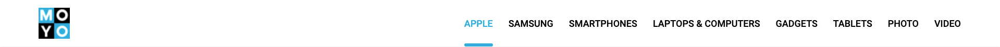

# Moyo header
Replace `<your_account>` with your Github username and copy the links to Pull Request description:
- [DEMO LINK](https://yevhenii-stanchenko.github.io/layout_moyo-header/)
- [TEST REPORT LINK](https://yevhenii-stanchenko.github.io/layout_moyo-header/report/html_report/)

> Follow [these instructions](https://mate-academy.github.io/layout_task-guideline/#how-to-solve-the-layout-tasks-on-github)

## ❗️❗️❗️ DON'T FORGET TO PROOFREAD YOUR CODE WITH [CHECKLIST](https://github.com/mate-academy/layout_moyo-header/blob/master/checklist.md) BEFORE SENDING YOUR PULL REQUEST❗️❗️❗️

## The task
Create HTML page with the header using `flexbox` basing on [this mockup](https://www.figma.com/file/KAV1NnDp7hgQtPnaD6XdOcnG/Moyo-%2F-Header).

### Requirements:
- pay attention the mock is adaptive. Develop the layout to fit on 1024px and 1200px the same as on the mock.
- reset browser default margins
- use images from [src/images](src/images)
- Use semantic tags: `<header>`, `<nav>`, `ul`
- change links styles on `:hover`
- follow styles from the mock
- the link with `blue` color and line below is an active link. It should have `class="is-active"` and relevant styles.
- the link with only `blue` color is an example of `:hover` styles. Every link in the row should have `blue` color on `:hover`.
- add `data-qa="hover"` attribute to the 4th link for testing (`Ноутбуки и компьютеры`)
---
--> [CHECKLIST](https://github.com/mate-academy/layout_moyo-header/blob/master/checklist.md)

### Tips & Hints
- Check one more time if you added `data-qa="hover"` and `class="is-active"`
required for tests
- Do not use `tabs`. Use `2 spaces` for indentation.
- Don't use repeated styles.
- Don't just copy all styles from Figma. Think, which of them are relevant.
Uneven sizes (e.g. `line-height: 14.6px`) are definitely useless.
- Don't use extra elements for blue line. Figure out how to work with `::after`
and positioning
- Check font styles. Use [google fonts](https://fonts.google.com/)
- Links in `nav` should have clickable area above and below the text
- Uppercase letters for `nav__list` are made with styles, not hardcoded into
html (you should have usual text with first uppercase letter in html)
- Don't set height for `header` explicitly. Let the content (links) dictate it.
- Logo should also be a link to the main page of the website (#home). But it
should not be part of `nav`.

### Требования:
- обратите внимание, макет адаптивный. Разработайте макет, чтобы он подходил для 1024px и 1200px так же, как на макете.
- сбросить поля браузера по умолчанию
- использовать изображения из [src/images](src/images)
- Используйте семантические теги: `<header>`, `<nav>`, `ul`
- изменить стили ссылок на `:hover`
- следовать стилям из макета
- ссылка с синим цветом и чертой внизу является активной ссылкой. Он должен иметь `class="is-active"` и соответствующие стили.
- ссылка только с синим цветом является примером стилей :hover. Каждая ссылка в строке должна иметь синий цвет при наведении курсора.
- добавить атрибут `data-qa="hover"` к 4-й ссылке для тестирования (`Ноутбуки и компьютеры`)
---
--> [КОНТРОЛЬНЫЙ СПИСОК] (https://github.com/mate-academy/layout_moyo-header/blob/master/checklist.md)

### Советы и подсказки
- Проверьте еще раз, если вы добавили `data-qa="hover"` и `class="is-active"`
требуется для тестов
- Не используйте вкладки. Используйте `2 пробела` для отступа.
- Не используйте повторяющиеся стили.
- Не копируйте все стили из Figma. Подумайте, какие из них актуальны.
Неравномерные размеры (например, `line-height: 14.6px`) определенно бесполезны.
- Не используйте лишние элементы для синей линии. Выясните, как работать с `::after`
и позиционирование
- Проверьте стили шрифтов. Используйте [шрифты Google](https://fonts.google.com/)
- Ссылки в `nav` должны иметь кликабельную область над и под текстом
- Буквы верхнего регистра для `nav__list` сделаны со стилями, а не жестко закодированы в
html (у вас должен быть обычный текст с первой заглавной буквой в html)
- Не устанавливайте высоту для `header` явно. Пусть контент (ссылки) диктует это.
- Логотип также должен быть ссылкой на главную страницу сайта (#home). Но это
не должен быть частью `nav`.